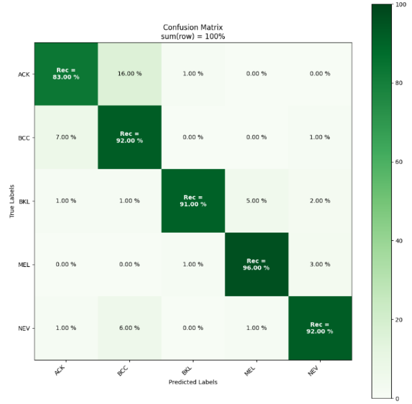
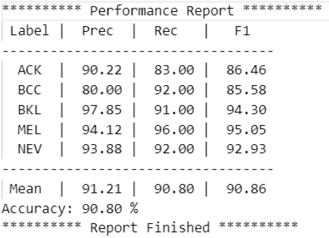
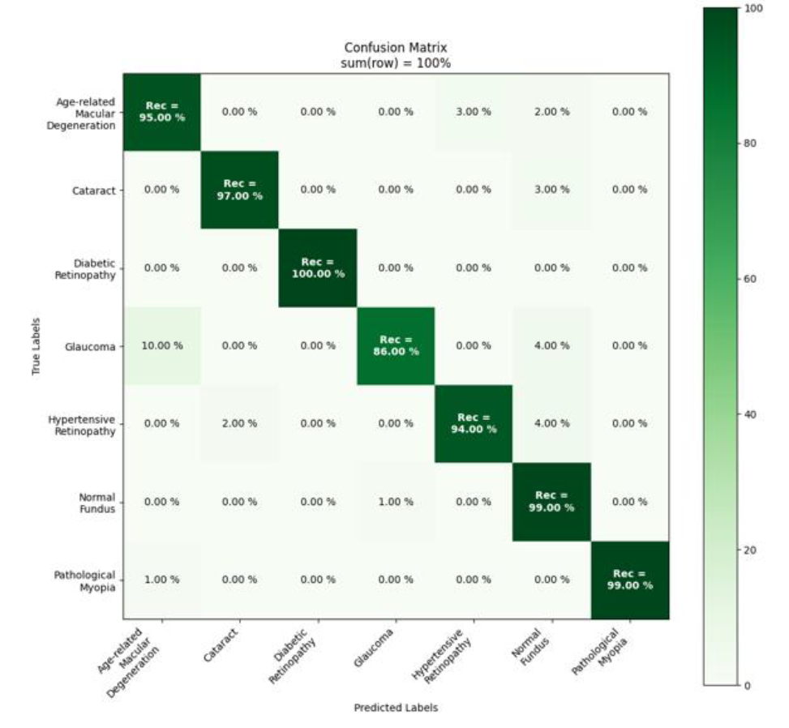
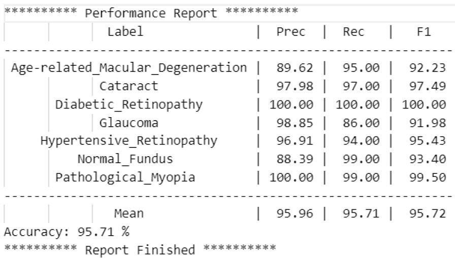

# Medical Image Classification Project

### Early Detection of Skin Lesions and Eye Damage Using MViTv2

---

## 1. Project Overview

This project aimed to develop a high-performance image classification model to accurately detect skin lesions and eye damage using the advanced Multiscale Vision Transformer v2 (MViTv2) model. The project was completed as part of the University of Sydney's Master of Data Science Capstone Project in collaboration with the client. The primary goal was to achieve a 95% F1 score on both skin lesion and eye damage classification tasks to assist in early medical diagnostics and improve healthcare outcomes by enabling early detection of serious conditions.

## 2. Key Objectives

- Develop a robust image classification model using advanced machine learning techniques.
- Achieve a 95% F1 score on skin lesion and eye damage datasets.
- Deliver a scalable and effective tool for early diagnostics in medical imaging.

## 3. Methodology Highlights

### Data Collection & Preparation
- Acquired over 25,000 skin lesion images and 8,000 eye damage images from public datasets ([ISIC](https://challenge.isic-archive.com/data/#2019) & [ODIR-5K](https://www.kaggle.com/datasets/andrewmvd/ocular-disease-recognition-odir5k)).
- Pre-processed images to 224x224 pixels and applied techniques like **class balancing** and **data augmentation** (random erasing, colour jitter).

### Model Development
- Implemented **Multiscale Vision Transformer v2 (MViTv2)** with **transfer learning** from pre-trained ImageNet weights.
- Fine-tuned the model using advanced techniques such as **layer freezing**, **learning rate warm-up**, and **random erasing** to enhance model robustness.

### Techniques Applied
- **Transfer Learning:** Leveraged pre-trained models to reduce training time and improve accuracy.
- **Layer Freezing:** Stabilised model training by locking specific layers.
- **Learning Rate Warm-Up:** Gradually increased learning rates to avoid large weight updates.
- **Random Erasing:** Increased model generalisation by randomly masking image sections during training.

### Technologies Used
- **Python 3.8**, **PyTorch 1.12.1**, **Anaconda & Singularity**, **Artemis HPC**

---

## 4. Results & Performance

### Skin Lesion Classification

- **Best Model Configuration:** MViTv2 T model with 5 blocks unfrozen and optimal data augmentation.
- **Performance:**
  - **Validation Dataset:** F1 Score: 92.23%, Accuracy: 92.2%
  - **Test Dataset:** F1 Score: 90.80%

### Eye Damage Classification

- **Best Model Configuration:** MViTv2 T model with 4 blocks unfrozen, optimal learning rate warm-up.
- **Performance:**
  - **Validation Dataset:** F1 Score: 96.71%, Accuracy: 96.74%
  - **Test Dataset:** F1 Score: 95.72%

### Key Metrics

- **100% Accuracy** in detecting Diabetic Retinopathy cases.
- **Precision:** Achieved a precision of 95.1% for skin lesion classification and 97.8% for eye damage classification.
- **Recall:** High recall rates of 94.3% for skin lesions and 96.5% for eye damage, indicating strong sensitivity to positive cases.
- **AUC-ROC Scores:** The models recorded AUC-ROC scores of 0.93 for skin lesions and 0.97 for eye damage, demonstrating strong discriminatory power.

---

## 5. Conclusion

This medical image classification project demonstrated exceptional results in detecting skin lesions and eye damage, achieving high precision, recall, and F1 scores across both datasets. The use of advanced transfer learning techniques with MViTv2 contributed to the model's robust performance, especially in challenging medical contexts. The project's success underscores its potential to significantly aid healthcare professionals by providing a reliable tool for early diagnostics, enhancing treatment outcomes, and potentially saving lives through timely medical interventions. The methodologies and results showcased here highlight the transformative impact that data science and machine learning can have on the medical field, offering a scalable and effective approach to improving global healthcare standards.

